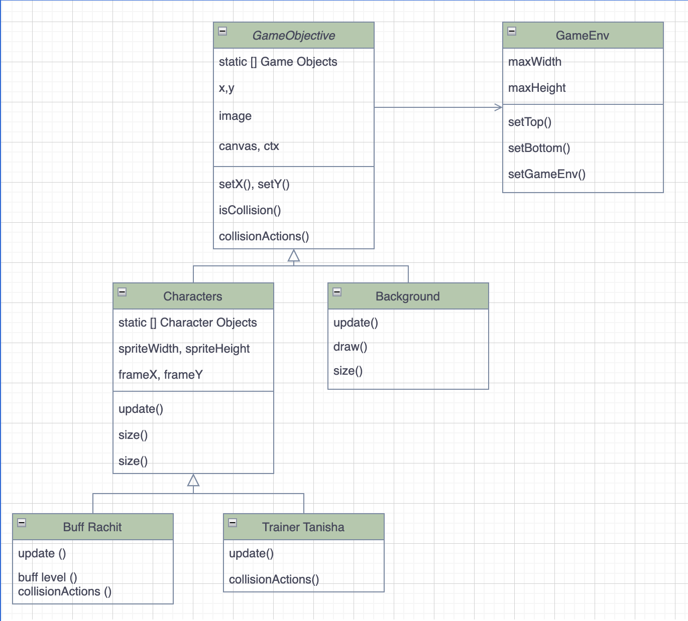

### Game Objectives:
The game starts by Ali going to Disneyland, attempting to pull out the sword but wouldn't move AT ALL. This motivates him to become buffed and come back to pull out the sword. 

The strength that he needs in order to pass the game is 800 lb worth full body pulling strength.
For Ali to become buffed, he has to answer some questions about the lessons we've learned from the other students in the class. 
One questions gives them 50 lb worth of full pulling strength. If they get one question wrong, they get 10 lb off, getting an injury. 
When Ali reaches exactly 800lb or more, his character changes into buffed Ali.

### Game Characters: 
#### - Ali (Before Buffed)
Basic idea of Ali before getting buffed:

#### - Ali (Buffed)
Basic idea/picure of  buffed Ali, might be developed over time :

.png>)

### Background:
##### There are two settings in the level, Disneyland and the Gym.
#### Gym 
Gym is for Ali to become buffed by using benchpress, deadlifts and other weights. 
Ali would get buffed here: 

#### Disneyland( in the Stone)
After, there is a button, transporting Rachit to Disneyland to check if he has enough strength, if he doesn't, there would be a sign saying how he needs more strength, and if he has enough strength, it would let him go to the next stage.
Ali would attempt to pull out the sword here:

### Game plan (Flowchart)
