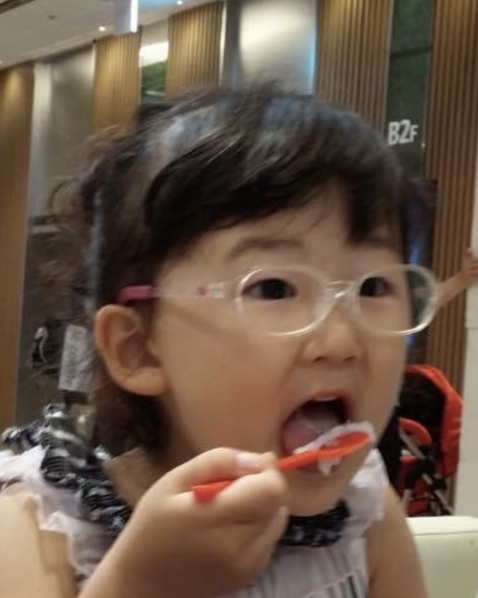

Hello! 
My name is Yuna Lee 
I was born in South Korea, and lived there until 1st grade. Then i moved to San Jose, CA and started from 2nd grade. Lastly I moved to San Diego and started middle school. Even though I lived in US for a long time, Korean is more confortable for me. My birthday is august 27 2010 so I'm almost always the youngest in the class. Some of my hobbies are to play bass guitar, crochet and watch movies. In the future I want to be an AI engineer. 

I like the color dark green, and some of the movies I love is the alien series and most of the science fiction movies. 

#### To learn what the link is going to be like, press the button on the bottom.

<a href="https://yuna599.github.io/Lucky-Charms/blogs/" style="text-decoration: none;">
    <button style="background-color: #20B2AA; color: white; padding: 10px 20px; border: none; border-radius: 5px; cursor: pointer;">
        Click to View
    </button>

#### Press the botton on the bottom to play game

<a href="https://yuna599.github.io/Lucky-Charms/simplegame/" style="text-decoration: none;">
    <button style="background-color: #20B2AA; color: white; padding: 10px 20px; border: none; border-radius: 5px; cursor: pointer;">
        Click to play
    </button>

[TOOLS VERIFY](https://yuna599.github.io/Lucky-Charms/devops/tools/verify)

 

[HW](../_notebooks/CSSE/Lessons/Iteration/2025-01-07-iterations_hw.ipynb)

[popcorn hacks](../_notebooks/CSSE/Lessons/Iteration/2025-01-07-iterations_popcorn_hacks.ipynb)