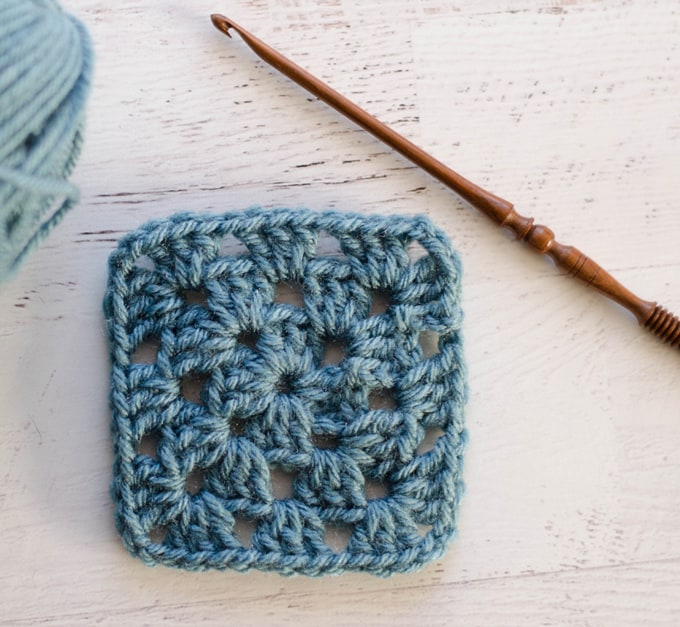

For people who really wanted to start a hobby could still couldn't find one, I think crocheting is one of the best choices. 

BEGGINERS:
    First of all, to start crocheting,  need a yarn and a crochet hook which aren't very expensive compared to other hobbies.

YARN:
    The first yarn doesn't really matter, you can choose any color and possiblely any type of material yarn but I suggest a 100% acrylic yarn.

CROCHET HOOK:
     The hook matters because if the hook is too big, then the result might be too loose and if the hook is too small, it might be hard to grab the yarns when doing the projects. For most of the yarns, it would be a 4mm size so I suggest buying this size before buying any other.

FIRST PROJECT:
    To be honest, you can choose any projects that you like to start with but ideally, most crocheters start with a granny square with is very easy and perfect for beginners. 
    

GRANNY SQUARE:
     When begginers start learning how to make a granny square, they would learn 2 new stitches called 'double crochet' and 'slip stitch'
    To learn how to make a granny square, it is best to search them on youtube for a tutorial.
    (To view the tutorial I suggest, go back to the homepage.)

AFTER THE FIRST PROJECT:
    After they learn how to use double crochet and slip stitch, they would eventually learn 3 other basic stitches: 'single crochet', 'half double crochet' and 'triple crochet'. 

After they learn these simple stitches and get used to it, they would be able to make better stitches and larger projects like bags, clothes and hats.